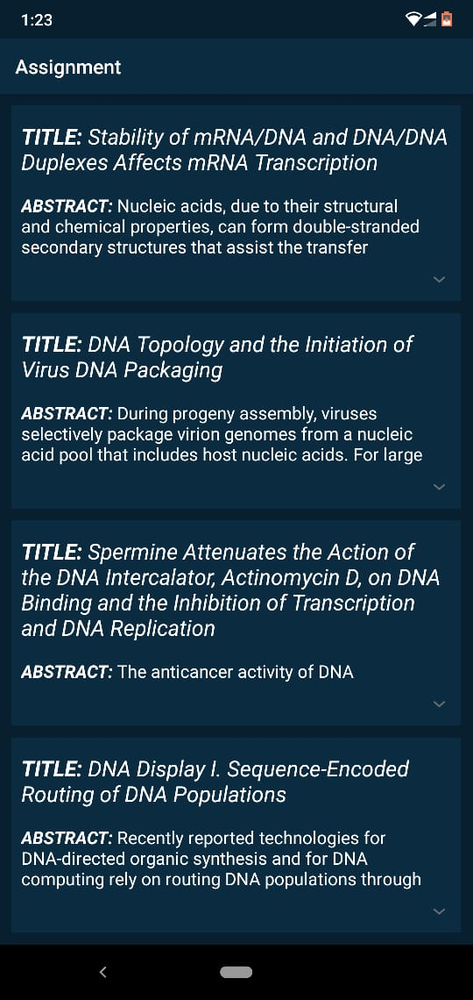
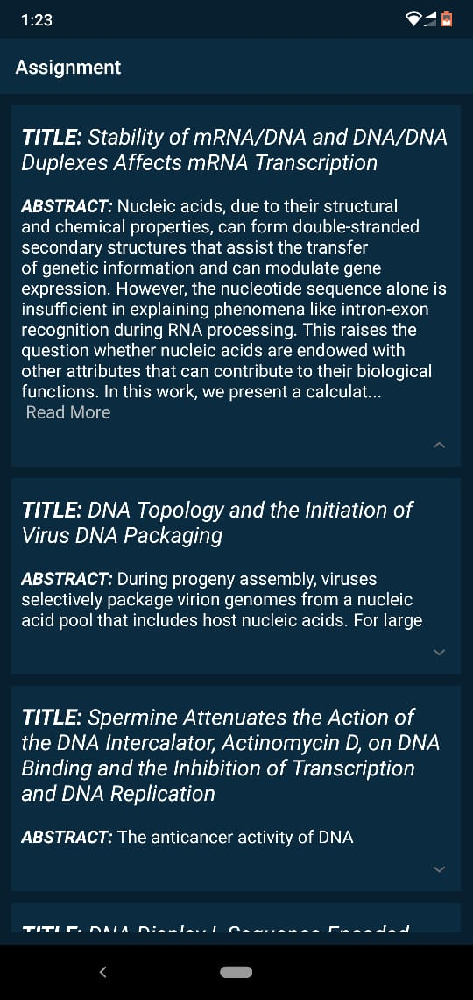
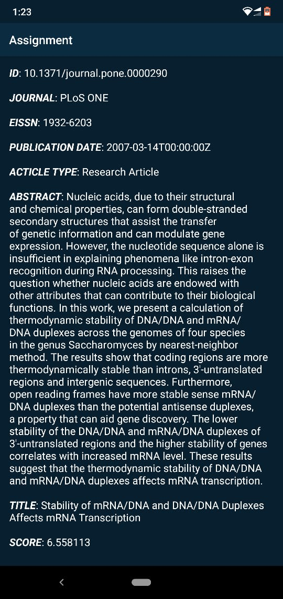

# Expandable-TextView
Fetching data from API http://api.plos.org/search?q=title:DNA and displaying it in expandable TextView.

## Features
- Uses recyclerView to display items from the API.
- Each recyclerView item is expandable.
- On clicking an item, it expands to show more information.
- On clicking read more, it expands to a screen where full detail is displayed.

## Screenshots

    

    

    
